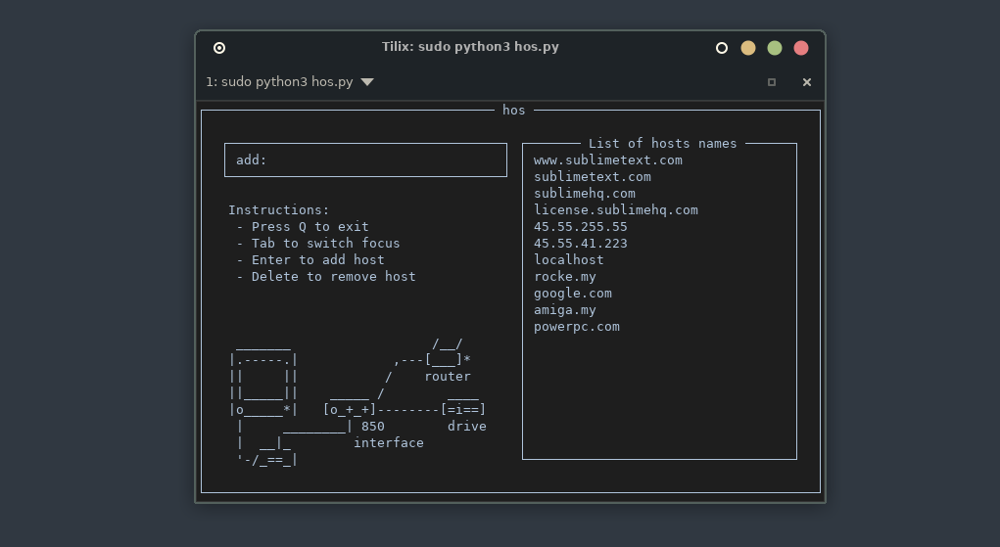

# hos - Console Utility for Managing Hosts File

**hos** is a Python-based console utility designed to easily manage entries in the `/etc/hosts` file. The utility provides a user-friendly interface to add, delete, and list domain names directly from the terminal.

## Features

- **Add Domains:** Quickly add new domains to the `/etc/hosts` file.
- **Delete Domains:** Easily remove domains from the `/etc/hosts` file.
- **View Existing Domains:** List all domains currently in the `/etc/hosts` file.
- **Interactive UI:** Simple and intuitive terminal-based interface using `urwid`.

## Screenshots



## Installation

### From GitHub

To install **hos** from the GitHub repository:

1. Clone the repository:

   ```bash
   git clone https://github.com/CtrlPy/hos.git
   ```

2. Navigate to the project directory:

   ```bash
   cd hos
   ```

3. Install the required dependencies:

   ```bash
   pip install -r requirements.txt
   ```

4. Run the utility:

   ```bash
   sudo python3 hos.py
   ```

### From PyPI

To install **hos-utility** directly from PyPI:

1. Install via pip:

   ```bash
   pip install hos-utility
   ```

2. Run the utility:

   ```bash
   sudo hos
   ```

## Usage

Once the utility is installed, you can use it by running:

```bash
sudo hos
```

- **Q:** Quit the utility.
- **Tab:** Switch focus between input and domain list.
- **Enter:** Add the entered domain to the `/etc/hosts` file.
- **Delete:** Remove the selected domain from the `/etc/hosts` file.

### Example

To add a new domain:

1. Type the domain in the `add:` field.
2. Press `Enter` to add it to the list.

To delete a domain:

1. Navigate to the domain in the list using the arrow keys.
2. Press `Delete` to remove it.

## Contributing

We welcome contributions to improve **hos**. Please feel free to submit issues, pull requests, or suggest new features.

## License

This project is licensed under the MIT License - see the [LICENSE](LICENSE) file for details.

## Future Plans

- **AUR Package:** We plan to make **hos** available on the Arch User Repository (AUR) for easy installation on Arch Linux and its derivatives.
- **Homebrew:** We also aim to publish **hos** on Homebrew for macOS users.

## Contact

For any questions or suggestions, please reach out to []().

---
